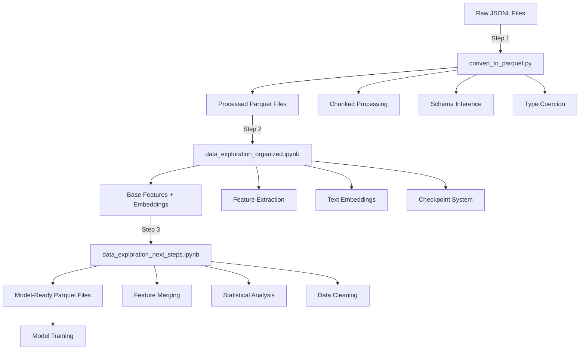
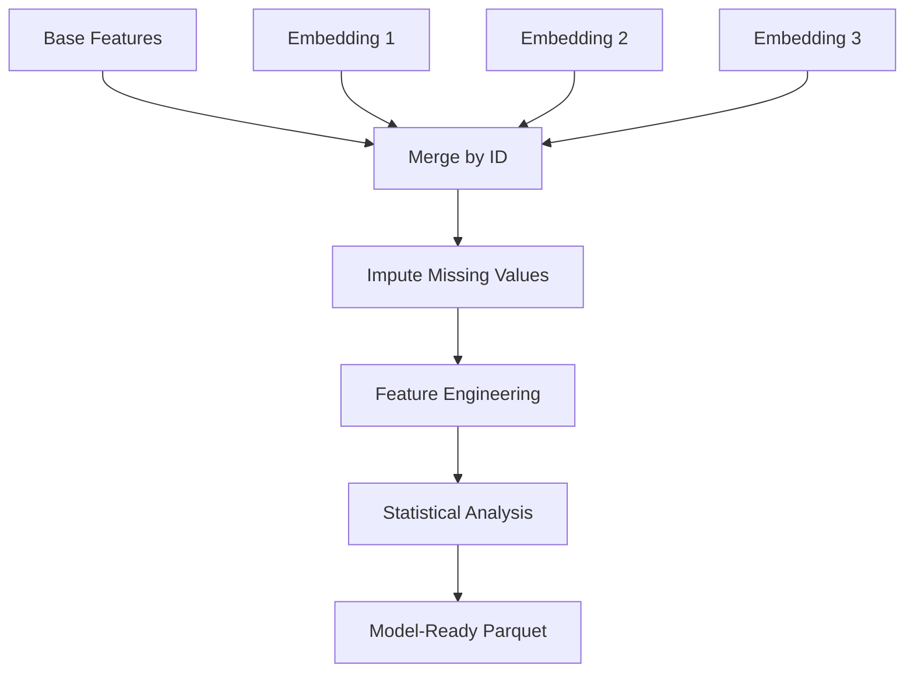

# Citation Prediction Project

<p align="center">
  
</p>

A machine learning pipeline for binary citation prediction (paper impact) using tabular features, transformer embeddings, and ensemble models.

**Competition**: [Kaggle F-25 SI-670 Kaggle 2](https://www.kaggle.com/competitions/f-25-si-670-kaggle-2)

**Repository**: [Citation-Prediction](https://github.com/horopter/Citation-Prediction) (GitHub)

**Note**: This repository uses Git LFS (Large File Storage) for large artifacts (data, models, embeddings). After cloning, run `git lfs install` and `git lfs pull` to fetch them. For packaging and large file handling, see `ZIP_INSTRUCTIONS.md` and `file_manager.py`.

## Overview

This project covers end-to-end ETL (JSONL to Parquet), feature extraction, embedding generation, model training, and ensemble inference for a Kaggle-style binary classification task. The ensemble uses saved model checkpoints in `models/saved_models/` and produces a Kaggle submission CSV via `src/scripts/ensemble_predict.py`.

## Key Features

- **Multi-Model Ensemble**: XGBoost, LightGBM, CatBoost, PyTorch MLP (optional sklearn MLP)
- **Advanced Feature Engineering**: 56 base features (54 numeric + 2 categorical) plus 1,920 embedding dimensions
- **Class Imbalance Handling**: SMOTETomek for tree models; class-weighted loss for PyTorch MLP
- **Robust Evaluation**: 5-fold CV and hyperparameter search for tree models; fixed-parameter CV validation for PyTorch; threshold optimization
- **Production-Ready**: Chunked processing, checkpointing, and aggressive memory cleanup
- **GreatLakes/SLURM Ready**: `src/scripts/run_*.sh` sbatch scripts for ETL and training
- **Branding Assets**: `Predicting Paper Impact.png` (primary) and `Predicting Paper Impact Square.png` (avatar/social)

## Quick Start

### Prerequisites

- Python 3.8+
- Git LFS
- CUDA (optional, for GPU acceleration)

```bash
git lfs install
git lfs pull
pip install -r requirements.txt
```

### Data Preparation

1. If raw JSONL files are not already present, place them in `data/raw/`:
   - `train.jsonl`
   - `val.jsonl`
   - `test.no_label.jsonl`

2. Convert to Parquet format (skip if already present):
   ```bash
   python3 src/scripts/convert_to_parquet.py
   ```

3. Build feature and embedding outputs (skip if already present):
   ```bash
   jupyter notebook src/notebooks/data_exploration_organized.ipynb
   jupyter notebook src/notebooks/data_exploration_next_steps.ipynb
   ```

### Model Training

Train individual models using Jupyter notebooks in `src/notebooks/`:

```bash
# XGBoost
jupyter notebook src/notebooks/model_xgboost_all_features.ipynb

# LightGBM
jupyter notebook src/notebooks/model_lightgbm_all_features.ipynb

# CatBoost
jupyter notebook src/notebooks/model_catboost_all_features.ipynb

# sklearn MLP (optional)
jupyter notebook src/notebooks/model_mlp_all_features.ipynb

# PyTorch MLP
jupyter notebook src/notebooks/model_pytorch_mlp_all_features.ipynb
```

Optional/experimental notebooks (not part of the default ensemble):
- `src/notebooks/model_randomforest_all_features.ipynb`
- `src/notebooks/model_multi_classifier_leakage_test.ipynb`

### Ensemble Prediction

After training all models, generate ensemble predictions:

```bash
# Basic usage - weighted mean ensemble
python3 src/scripts/ensemble_predict.py

# Use specific models
python3 src/scripts/ensemble_predict.py --models model_xgboost model_lightgbm model_catboost

# Try different ensemble methods
python3 src/scripts/ensemble_predict.py --method geometric_mean
```

#### Detailed Ensemble Usage

**Quick Start:**
```bash
# Basic usage - uses all models with weighted mean ensemble
python3 src/scripts/ensemble_predict.py
```

This will:
1. Load all models from `models/saved_models/`
2. Load test data from `data/model_ready/test_model_ready.parquet`
3. Generate ensemble predictions
4. Save submission to `data/submission_files/submission_ensemble.csv`

**Prerequisites:**
1. **Test data**: `data/model_ready/test_model_ready.parquet` must exist
2. **Saved models**: At least one model file in `models/saved_models/` (e.g., `model_xgboost_all_features_best.pkl`)
3. **Python packages**: `polars`, `numpy`, `torch` (optional, for PyTorch MLP models)

**Usage Examples:**

1. **Basic Ensemble (All Models)**
   ```bash
   python3 src/scripts/ensemble_predict.py
   ```

2. **Use Specific Models Only**
   ```bash
   python3 src/scripts/ensemble_predict.py --models model_xgboost model_lightgbm model_catboost
   ```

3. **Try Different Ensemble Methods**
   - Weighted Mean (default): `python3 src/scripts/ensemble_predict.py --method weighted_mean`
   - Majority Voting: `python3 src/scripts/ensemble_predict.py --method vote`
   - Geometric Mean: `python3 src/scripts/ensemble_predict.py --method geometric_mean`
   - Simple Average: `python3 src/scripts/ensemble_predict.py --method mean`
   - Rank-based: `python3 src/scripts/ensemble_predict.py --method rank_mean`

4. **Custom Threshold**
   ```bash
   python3 src/scripts/ensemble_predict.py --threshold 0.4
   ```

5. **Different Tie-Breaking Strategy**
   ```bash
   # Conservative (predict negative on ties)
   python3 src/scripts/ensemble_predict.py --tie-breaker conservative
   
   # Aggressive (predict positive on ties)
   python3 src/scripts/ensemble_predict.py --tie-breaker aggressive
   
   # Use probability mean to break ties
   python3 src/scripts/ensemble_predict.py --tie-breaker prob_mean

   # Round 0.5 up or down on ties
   python3 src/scripts/ensemble_predict.py --tie-breaker round_up
   python3 src/scripts/ensemble_predict.py --tie-breaker round_down
   ```

6. **Use GPU for PyTorch Models**
   ```bash
   python3 src/scripts/ensemble_predict.py --device cuda
   ```

**Command Line Options:**
```
--test-data PATH          Path to test data parquet file
                          Default: data/model_ready/test_model_ready.parquet

--models-dir PATH         Directory containing saved model .pkl files
                          Default: models/saved_models

--output PATH             Output submission file path
                          Default: data/submission_files/submission_ensemble.csv

--models [MODELS ...]     Specific model files to use (optional)
                          Example: --models model_xgboost model_lightgbm

--method METHOD           Ensemble method:
                          - mean: Simple average
                          - weighted_mean: Weighted by performance (default)
                          - geometric_mean: Geometric mean
                          - rank_mean: Rank-based averaging
                          - vote: Majority voting

--threshold FLOAT         Classification threshold (auto if not specified)
                          Uses average of model thresholds if available

--tie-breaker STRATEGY    Tie-breaking strategy:
                          - conservative: Predict negative (default)
                          - aggressive: Predict positive
                          - prob_mean: Use probability mean
                          - round_up: Round 0.5 up
                          - round_down: Round 0.5 down

--device DEVICE           Device for PyTorch models (cpu or cuda)
                          Default: cpu
```

**Output:**
The script generates a CSV file with two columns:
- `work_id`: Work identifier
- `label`: Binary prediction (0 or 1)

**Troubleshooting:**
- **Error: "Test data not found"**: Make sure `data/model_ready/test_model_ready.parquet` exists
- **Error: "No model files found"**: Ensure model files are in `models/saved_models/` with naming pattern `model_*_all_features_best.pkl`
- **Error: "PyTorch not available"**: Install `torch` or skip PyTorch models
- **Error: "Feature mismatch"**: Models were trained with different preprocessing pipelines
- **Missing LFS assets**: Run `git lfs pull`

### GreatLakes / SLURM Deployment

```bash
# Submit notebook/model jobs
sbatch src/scripts/run_data_exploration_organized.sh
sbatch src/scripts/run_data_exploration_next_steps.sh
sbatch src/scripts/run_model_xgboost.sh
sbatch src/scripts/run_model_lightgbm.sh
sbatch src/scripts/run_model_catboost.sh
sbatch src/scripts/run_model_pytorch_mlp.sh
```

Update the SLURM headers (account, email, partition, time) as needed for your cluster.

## ETL Pipeline

The ETL (Extract, Transform, Load) pipeline transforms raw JSONL files into model-ready Parquet files through three main stages. This section provides a comprehensive overview of the data transformation process.

### Pipeline Overview



### Stage 1: Data Ingestion (JSONL to Parquet)

**Script**: `src/scripts/convert_to_parquet.py`

**Purpose**: Convert raw JSONL files to efficient Parquet format with chunked processing for memory efficiency.

**Input Files**:
- `data/raw/train.jsonl`
- `data/raw/val.jsonl`
- `data/raw/test.no_label.jsonl`

**Output Files**:
- `data/processed/train.parquet`
- `data/processed/val.parquet`
- `data/processed/test.parquet`

**Key Features**:
- **Chunked Processing**: Processes files in configurable chunks (default: 5000 records) to handle large datasets
- **Schema Inference**: Automatically infers schema from first chunk, handles inconsistencies
- **Type Coercion**: Converts data types appropriately (strings, numbers, dates)
- **Memory Efficient**: Processes one chunk at a time, writes immediately to disk

**Usage**:
```bash
python3 src/scripts/convert_to_parquet.py
```

**Processing Details**:
1. Reads JSONL file line by line in chunks
2. Parses JSON and infers schema
3. Handles schema inconsistencies across chunks
4. Writes each chunk to Parquet format
5. Combines chunks into final Parquet file

### Stage 2: Feature Extraction and Embedding Generation

**Notebook**: `src/notebooks/data_exploration_organized.ipynb`

**Purpose**: Extract structured features from nested JSON and generate text embeddings using pre-trained transformer models.

**Input Files**:
- `data/processed/train.parquet`
- `data/processed/val.parquet`
- `data/processed/test.parquet`

**Output Files**:
- `data/results/X_train.parquet`, `X_val.parquet`, `X_test.parquet` (base features)
- `data/results/y_train.npy`, `y_val.npy` (labels)
- `data/results/sent_transformer_X_*.parquet` (Sentence Transformer embeddings)
- `data/results/scibert_X_*.parquet` (SciBERT embeddings)
- `data/results/specter2_X_*.parquet` (SPECTER2 embeddings)

**Key Features**:
- **Checkpoint System**: Automatic saving of progress for resumability after failures
- **Chunked Processing**: Processes data in configurable chunks (default: 1000 records)
- **Memory Management**: Aggressive cleanup between operations
- **Batch Processing**: Efficient batching for embedding generation

**Feature Extraction** (56 base features: 54 numeric + 2 categorical):
- **Temporal Features**: Publication dates, update dates, days since publication
- **Statistical Features**: Counts, averages, distributions
- **Text Features**: Title length, abstract length, keyword counts
- **Metadata Features**: Journal information, author counts, reference counts
- **Domain-Specific Features**: Citation-related metrics, open access indicators

**Embedding Models**:
1. **Sentence Transformers** (`all-MiniLM-L6-v2`)
   - Dimensions: 384
   - Purpose: General-purpose semantic embeddings
   - Speed: Fast

2. **SciBERT** (`allenai/scibert_scivocab_uncased`)
   - Dimensions: 768
   - Purpose: Scientific domain-specific embeddings
   - Speed: Moderate

3. **SPECTER2** (`allenai/specter2`)
   - Dimensions: 768
   - Purpose: Citation-aware scientific embeddings
   - Speed: Moderate

**Processing Flow**:


**Memory Management**:
- Processes one chunk at a time
- Clears GPU cache after each embedding batch
- Aggressive garbage collection between operations
- Checkpoint system allows resuming from failures

### Stage 3: Feature Merging and Model-Ready Preparation

**Notebook**: `src/notebooks/data_exploration_next_steps.ipynb`

**Purpose**: Combine base features with embeddings, perform statistical analysis, clean data, and create final model-ready datasets.

**Input Files**:
- `data/results/X_train.parquet`, `X_val.parquet`, `X_test.parquet`
- `data/results/y_train.npy`, `y_val.npy`
- `data/results/*_X_*.parquet` (embedding files)

**Output Files**:
- `data/model_ready/train_model_ready.parquet`
- `data/model_ready/val_model_ready.parquet`
- `data/model_ready/test_model_ready.parquet`
- `data/model_ready/feature_label_correlations.csv`
- `data/model_ready/categorical_chi2_cramersv.csv`
- `data/model_ready/anova_numeric_features_vs_label.csv`
- `data/model_ready/tukey_hsd_top_features.csv`
- `data/model_ready/missingness_report.csv`
- `data/model_ready/imputation_spec.json`

**Processing Steps**:

1. **Feature Merging**
   - Loads base feature matrices and all available embedding parquets
   - Merges embeddings into base features by `id` column
   - Handles missing embedding files gracefully

2. **Missing Value Imputation**
   - Train-centric imputation: computes imputation values from training set only
   - Applies same imputation to validation and test sets
   - Prevents data leakage

3. **Feature Engineering**
   - Replaces `is_oa` with `is_not_oa` (1 - is_oa) for better signal
   - Creates derived features where appropriate
   - Preserves all non-embedding features (no feature reduction)

4. **Statistical Analysis**
   - **Correlation Analysis**: Pearson and Spearman correlations
   - **Chi-square Tests**: For categorical features
   - **Cramer's V**: Measure of association for categorical variables
   - **ANOVA**: Analysis of variance for continuous features
   - **Tukey's HSD**: Post-hoc analysis for significant differences

5. **Data Validation**
   - Checks for data consistency
   - Validates feature shapes and types
   - Ensures no data leakage between splits

**Final Feature Set**:
- **Base Features**: 56 total (54 numeric + 2 categorical)
- **Embedding Features**: 1,920 numeric dimensions
- **Total Numeric Features**: 1,974 (54 base + 1,920 embeddings)
- **Categorical Features**: 2
- **Additional Columns**: `id` (and `label` in train/val)

**Data Flow**:


### Memory Management Strategies

Throughout the ETL pipeline, several strategies ensure efficient memory usage:

1. **Chunked Processing**: All stages process data in chunks rather than loading entire datasets
2. **Immediate Persistence**: Results saved to disk after each chunk
3. **Aggressive Cleanup**: Garbage collection and GPU cache clearing between operations
4. **Checkpoint System**: Automatic saving of progress for resumability
5. **Lazy Loading**: Data loaded only when needed
6. **Polars Usage**: High-performance DataFrame library instead of pandas for better memory efficiency

### Data Flow Summary

| Stage | Input | Output | Key Operations |
|-------|-------|--------|----------------|
| **1. Ingestion** | JSONL files | Parquet files | Chunked reading, schema inference, type coercion |
| **2. Feature Extraction** | Parquet files | Base features (56) + embeddings | Feature engineering, transformer embeddings, checkpointing |
| **3. Merging** | Base features + embeddings | Model-ready Parquet | Feature merging, imputation, statistical analysis |

### Pipeline Execution Order

1. **Run `convert_to_parquet.py`**: Converts raw JSONL to Parquet
2. **Run `data_exploration_organized.ipynb`**: Extracts features and generates embeddings
3. **Run `data_exploration_next_steps.ipynb`**: Merges features and creates model-ready data
4. **Train Models**: Use model-ready data for training

### Output Validation

After each stage, validate outputs:
- **Stage 1**: Check Parquet file sizes and record counts match JSONL files
- **Stage 2**: Verify base feature count (56) and embedding dimensions
- **Stage 3**: Confirm 1,974 numeric features plus 2 categorical features and data consistency

### Troubleshooting

- **Out of Memory**: Reduce chunk sizes in configuration
- **Missing Embeddings**: Check if embedding models downloaded correctly
- **Schema Errors**: Verify JSONL file format and structure
- **Checkpoint Recovery**: Pipeline automatically resumes from last checkpoint

## Project Structure

```
Kaggle2/
├── Predicting Paper Impact.png
├── Predicting Paper Impact Square.png
├── README.md
├── ZIP_INSTRUCTIONS.md
├── file_manager.py
├── complete_sync.sh
├── data/                    # Data directory
│   ├── checkpoints/         # Checkpointed intermediate outputs
│   ├── model_ready/         # Feature-engineered data
│   ├── nltk_data/           # NLTK resources
│   ├── processed/           # Processed parquet files
│   ├── raw/                 # Input JSONL files
│   ├── results/             # Intermediate results (embeddings, features)
│   ├── submission_files/    # Model predictions
│   └── temp/                # Scratch space
├── models/                  # Model files
│   ├── saved_models/        # Trained model checkpoints
│   ├── allenai_scibert_scivocab_uncased/  # SciBERT weights
│   ├── allenai_specter2/    # SPECTER2 weights
│   └── sentence-transformers_all-MiniLM-L6-v2/  # Sentence Transformer
├── src/                     # Source code
│   ├── notebooks/           # Training notebooks
│   ├── experimental/        # Experimental model notebooks
│   ├── scripts/             # Python and shell scripts
│   └── utils/               # Utility modules
├── docs/                    # Documentation
├── logs/                    # Execution logs
├── metrics/                 # Performance metrics
├── runs/                    # Executed notebook outputs
├── catboost_info/           # CatBoost training logs
├── venv/                    # Local virtual environment (optional)
└── requirements.txt         # Python dependencies
```

See [docs/PROJECT_STRUCTURE.md](docs/PROJECT_STRUCTURE.md) for detailed structure.

## Modeling Approach

The project uses a unified preprocessing pipeline with:
- **Feature Engineering**: 56 base features (54 numeric + 2 categorical) plus 3 embedding families
- **Preprocessing**: PCA compression for embeddings in tree models, StandardScaler, SMOTETomek
- **Training**: 5-fold CV and hyperparameter tuning for tree models; fixed-parameter CV validation for PyTorch; threshold optimization
- **Ensemble**: Weighted averaging based on validation F1 scores

### Detailed Modeling Approach

**Base Features:** 54 numeric features plus 2 categorical features extracted from the raw data, including statistical and domain-specific attributes.

**Embedding Families:** Three pre-trained embedding models capture semantic information:
- **Sentence Transformers** (`all-MiniLM-L6-v2`): 384-dimensional embeddings
- **SciBERT** (`allenai/scibert_scivocab_uncased`): 768-dimensional embeddings
- **SPECTER2** (`allenai/specter2`): 768-dimensional embeddings

**Feature Combination:** The model-ready dataset contains 1,974 numeric features (54 base + 1,920 embeddings) plus 2 categorical columns. The `id` column is retained for joins and submission generation.

**Preprocessing Pipeline:**
1. **PCA Compression** (tree models): IncrementalPCA reduces each embedding family to 32 components for efficiency.
2. **Feature Scaling**: StandardScaler normalization applied to numeric features.
3. **Categorical Handling**: Categorical columns are encoded in the training notebooks per model.
4. **Class Imbalance Handling**: SMOTETomek resampling for tree models; class-weighted loss for PyTorch MLP.
5. **Memory Management**: Chunked processing and aggressive garbage collection to avoid OOM failures.

**Training Strategy:**
- **Cross-Validation**: 5-fold stratified CV for tree models
- **Hyperparameter Tuning**: RandomizedSearchCV/GridSearchCV for tree models
- **PyTorch Validation**: Fixed hyperparameters with CV validation (subset for large datasets)
- **Threshold Optimization**: Fine-grained threshold search using precision-recall curves
- **Model Calibration**: Isotonic calibration for tree models where applicable
- **Early Stopping**: Implemented for gradient boosting models

**Ensemble Strategy:**
- **Weighted Ensemble**: Weights are derived from each model's best F1 (or best CV score) squared.
- **Ensemble Methods Available:**
  - **Weighted Mean** (default): Performance-weighted average of probabilities
  - **Geometric Mean**: Geometric mean of probabilities
  - **Rank-based Mean**: Average of rank-transformed predictions
  - **Majority Voting**: Binary voting with tie-breaking strategies

See [docs/MODELING_APPROACH.md](docs/MODELING_APPROACH.md) for even more comprehensive details.

## Documentation

- [Dataset Information](docs/README.md) - Kaggle dataset details
- [Project Structure](docs/PROJECT_STRUCTURE.md) - Folder organization and data flow
- [Modeling Approach](docs/MODELING_APPROACH.md) - Comprehensive technical approach
- [Model Comparison Report](docs/MODEL_COMPARISON_REPORT.md) - Detailed comparison of XGBoost, CatBoost, and LightGBM
- [Notebook Workflow](docs/NOTEBOOK_WORKFLOW.md) - Complete pipeline flow and notebook purposes
- [Packaging and Large Files](ZIP_INSTRUCTIONS.md) - Safe archive creation guidance

## Models Trained

Primary models used in the default ensemble:
1. **XGBoost** - Gradient boosting with tree-based learning
2. **LightGBM** - Optimized gradient boosting
3. **CatBoost** - Gradient boosting with categorical handling
4. **PyTorch MLP** - Deep neural network with batch normalization

Optional/experimental models:
- **sklearn MLP** - Multi-layer perceptron neural network
- **RandomForest** - Baseline tree ensemble
- **Leakage test baselines** - Models saved as `model_*_leakage_test.pkl`

## Requirements

- Python 3.8+
- Git LFS (required for data/models)
- See `requirements.txt` for full dependency list
- PyTorch (for PyTorch MLP model)
- CUDA (optional, for GPU acceleration)

## License

This project is for academic/educational purposes.

## Author

Citation Prediction Project - SI 670 F25
