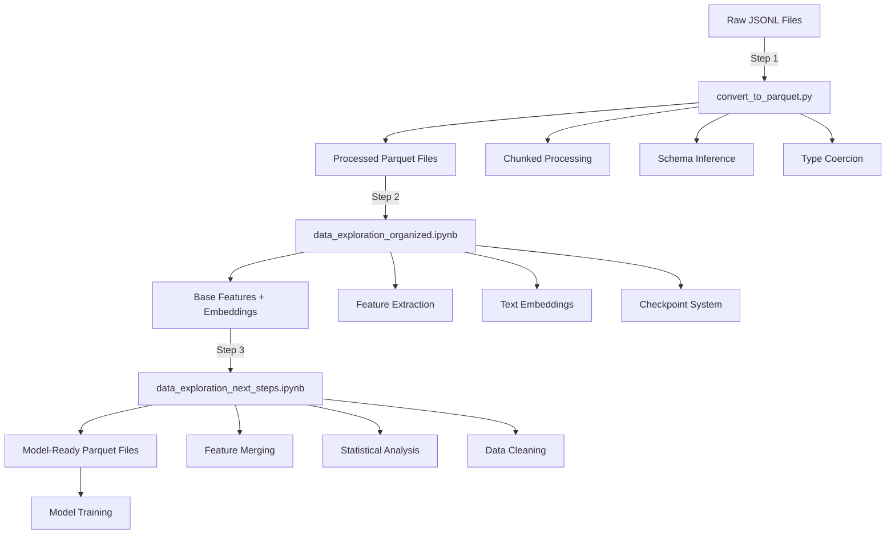
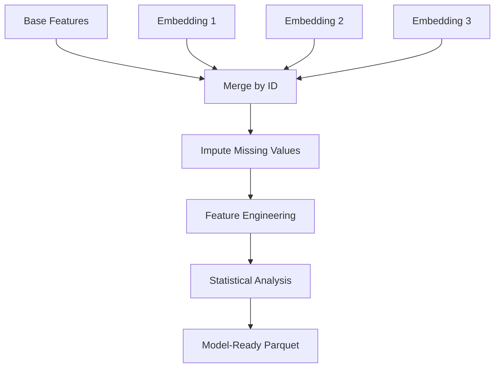

# Citation Prediction Project

A comprehensive machine learning pipeline for binary classification of academic papers using ensemble methods and state-of-the-art text embeddings.

**Competition**: [Kaggle F-25 SI-670 Kaggle 2](https://www.kaggle.com/competitions/f-25-si-670-kaggle-2)

**Repository**: [Citation-Prediction](https://github.com/horopter/Citation-Prediction) (GitHub)

**Note**: This repository uses Git LFS (Large File Storage) for large files including data files (.parquet), model files (.pkl, .npy), and embedding models. All files are synced to the remote repository.

## Overview

This project implements a multi-model ensemble approach for predicting citations in academic papers. It combines traditional feature engineering with pre-trained text embeddings (SciBERT, SPECTER2, Sentence Transformers) and uses multiple model architectures (XGBoost, LightGBM, CatBoost, MLP) with a weighted ensemble strategy.

## Key Features

- **Multi-Model Ensemble**: Combines 5 different model architectures
- **Advanced Feature Engineering**: 54 regular features + 1,920 embedding dimensions
- **Class Imbalance Handling**: SMOTETomek resampling
- **Robust Evaluation**: 5-fold cross-validation with hyperparameter tuning
- **Production-Ready**: OOM-resistant design with chunked processing
- **GreatLakes Compatible**: SLURM scripts for cluster deployment

## Quick Start

### Prerequisites

```bash
# Install dependencies
pip install -r requirements.txt
```

### Data Preparation

1. Place raw JSONL files in `data/raw/`:
   - `train.jsonl`
   - `val.jsonl`
   - `test.no_label.jsonl`

2. Convert to Parquet format:
   ```bash
   python3 src/scripts/convert_to_parquet.py
   ```

### Model Training

Train individual models using Jupyter notebooks in `src/notebooks/`:

```bash
# XGBoost
jupyter notebook src/notebooks/model_xgboost_all_features.ipynb

# LightGBM
jupyter notebook src/notebooks/model_lightgbm_all_features.ipynb

# CatBoost
jupyter notebook src/notebooks/model_catboost_all_features.ipynb

# PyTorch MLP
jupyter notebook src/notebooks/model_pytorch_mlp_all_features.ipynb
```

### Ensemble Prediction

After training all models, generate ensemble predictions:

```bash
# Basic usage - weighted mean ensemble
python3 src/scripts/ensemble_predict.py

# Use specific models
python3 src/scripts/ensemble_predict.py --models model_xgboost model_lightgbm model_catboost

# Try different ensemble methods
python3 src/scripts/ensemble_predict.py --method geometric_mean
```

#### Detailed Ensemble Usage

**Quick Start:**
```bash
# Basic usage - uses all models with weighted mean ensemble
python3 src/scripts/ensemble_predict.py
```

This will:
1. Load all models from `models/saved_models/`
2. Load test data from `data/model_ready/test_model_ready.parquet`
3. Generate ensemble predictions
4. Save submission to `data/submission_files/submission_ensemble.csv`

**Prerequisites:**
1. **Test data**: `data/model_ready/test_model_ready.parquet` must exist
2. **Saved models**: At least one model file in `models/saved_models/` (e.g., `model_xgboost_all_features_best.pkl`)
3. **Python packages**: `polars`, `numpy`, `torch` (optional, for PyTorch MLP models)

**Usage Examples:**

1. **Basic Ensemble (All Models)**
   ```bash
   python3 src/scripts/ensemble_predict.py
   ```

2. **Use Specific Models Only**
   ```bash
   python3 src/scripts/ensemble_predict.py --models model_xgboost model_lightgbm model_catboost
   ```

3. **Try Different Ensemble Methods**
   - Majority Voting: `python3 src/scripts/ensemble_predict.py --method vote`
   - Geometric Mean: `python3 src/scripts/ensemble_predict.py --method geometric_mean`
   - Simple Average: `python3 src/scripts/ensemble_predict.py --method mean`
   - Rank-based: `python3 src/scripts/ensemble_predict.py --method rank_mean`

4. **Custom Threshold**
   ```bash
   python3 src/scripts/ensemble_predict.py --threshold 0.4
   ```

5. **Different Tie-Breaking Strategy**
   ```bash
   # Conservative (predict negative on ties)
   python3 src/scripts/ensemble_predict.py --tie-breaker conservative
   
   # Aggressive (predict positive on ties)
   python3 src/scripts/ensemble_predict.py --tie-breaker aggressive
   
   # Use probability mean to break ties
   python3 src/scripts/ensemble_predict.py --tie-breaker prob_mean
   ```

6. **Use GPU for PyTorch Models**
   ```bash
   python3 src/scripts/ensemble_predict.py --device cuda
   ```

**Command Line Options:**
```
--test-data PATH          Path to test data parquet file
                          Default: data/model_ready/test_model_ready.parquet

--models-dir PATH         Directory containing saved model .pkl files
                          Default: models/saved_models

--output PATH             Output submission file path
                          Default: data/submission_files/submission_ensemble.csv

--models [MODELS ...]     Specific model files to use (optional)
                          Example: --models model_xgboost model_lightgbm

--method METHOD           Ensemble method:
                          - mean: Simple average
                          - weighted_mean: Weighted by performance (default)
                          - geometric_mean: Geometric mean
                          - rank_mean: Rank-based averaging
                          - vote: Majority voting

--threshold FLOAT         Classification threshold (auto if not specified)
                          Uses average of model thresholds if available

--tie-breaker STRATEGY    Tie-breaking strategy:
                          - conservative: Predict negative (default)
                          - aggressive: Predict positive
                          - prob_mean: Use probability mean

--device DEVICE           Device for PyTorch models (cpu or cuda)
                          Default: cpu
```

**Output:**
The script generates a CSV file with two columns:
- `work_id`: Work identifier
- `label`: Binary prediction (0 or 1)

**Troubleshooting:**
- **Error: "Test data not found"**: Make sure `data/model_ready/test_model_ready.parquet` exists
- **Error: "No model files found"**: Ensure model files are in `models/saved_models/` with naming pattern `model_*_all_features_best.pkl`
- **Error: "PyTorch not available"**: Install `torch` or skip PyTorch models
- **Error: "Feature mismatch"**: Models were trained with different preprocessing pipelines

### GreatLakes Cluster Deployment

```bash
# Submit ensemble job
sbatch run_ensemble_greatlakes.sh
```

## ETL Pipeline

The ETL (Extract, Transform, Load) pipeline transforms raw JSONL files into model-ready Parquet files through three main stages. This section provides a comprehensive overview of the data transformation process.

### Pipeline Overview



### Stage 1: Data Ingestion (JSONL → Parquet)

**Script**: `src/scripts/convert_to_parquet.py`

**Purpose**: Convert raw JSONL files to efficient Parquet format with chunked processing for memory efficiency.

**Input Files**:
- `data/raw/train.jsonl`
- `data/raw/val.jsonl`
- `data/raw/test.no_label.jsonl`

**Output Files**:
- `data/processed/train.parquet`
- `data/processed/val.parquet`
- `data/processed/test.parquet`

**Key Features**:
- **Chunked Processing**: Processes files in configurable chunks (default: 5000 records) to handle large datasets
- **Schema Inference**: Automatically infers schema from first chunk, handles inconsistencies
- **Type Coercion**: Converts data types appropriately (strings, numbers, dates)
- **Memory Efficient**: Processes one chunk at a time, writes immediately to disk

**Usage**:
```bash
python3 src/scripts/convert_to_parquet.py
```

**Processing Details**:
1. Reads JSONL file line by line in chunks
2. Parses JSON and infers schema
3. Handles schema inconsistencies across chunks
4. Writes each chunk to Parquet format
5. Combines chunks into final Parquet file

### Stage 2: Feature Extraction & Embedding Generation

**Notebook**: `src/notebooks/data_exploration_organized.ipynb`

**Purpose**: Extract structured features from nested JSON and generate text embeddings using pre-trained transformer models.

**Input Files**:
- `data/processed/train.parquet`
- `data/processed/val.parquet`
- `data/processed/test.parquet`

**Output Files**:
- `data/results/X_train.parquet`, `X_val.parquet`, `X_test.parquet` (base features)
- `data/results/y_train.npy`, `y_val.npy` (labels)
- `data/results/sent_transformer_X_*.parquet` (Sentence Transformer embeddings)
- `data/results/scibert_X_*.parquet` (SciBERT embeddings)
- `data/results/specter2_X_*.parquet` (SPECTER2 embeddings)

**Key Features**:
- **Checkpoint System**: Automatic saving of progress for resumability after failures
- **Chunked Processing**: Processes data in configurable chunks (default: 1000 records)
- **Memory Management**: Aggressive cleanup between operations
- **Batch Processing**: Efficient batching for embedding generation

**Feature Extraction** (54+ structured features):
- **Temporal Features**: Publication dates, update dates, days since publication
- **Statistical Features**: Counts, averages, distributions
- **Text Features**: Title length, abstract length, keyword counts
- **Metadata Features**: Journal information, author counts, reference counts
- **Domain-Specific Features**: Citation-related metrics, open access indicators

**Embedding Models**:
1. **Sentence Transformers** (`all-MiniLM-L6-v2`)
   - Dimensions: 384
   - Purpose: General-purpose semantic embeddings
   - Speed: Fast

2. **SciBERT** (`allenai/scibert_scivocab_uncased`)
   - Dimensions: 768
   - Purpose: Scientific domain-specific embeddings
   - Speed: Moderate

3. **SPECTER2** (`allenai/specter2`)
   - Dimensions: 768
   - Purpose: Citation-aware scientific embeddings
   - Speed: Moderate

**Processing Flow**:


**Memory Management**:
- Processes one chunk at a time
- Clears GPU cache after each embedding batch
- Aggressive garbage collection between operations
- Checkpoint system allows resuming from failures

### Stage 3: Feature Merging & Model-Ready Preparation

**Notebook**: `src/notebooks/data_exploration_next_steps.ipynb`

**Purpose**: Combine base features with embeddings, perform statistical analysis, clean data, and create final model-ready datasets.

**Input Files**:
- `data/results/X_train.parquet`, `X_val.parquet`, `X_test.parquet`
- `data/results/y_train.npy`, `y_val.npy`
- `data/results/*_X_*.parquet` (embedding files)

**Output Files**:
- `data/model_ready/train_model_ready.parquet`
- `data/model_ready/val_model_ready.parquet`
- `data/model_ready/test_model_ready.parquet`

**Processing Steps**:

1. **Feature Merging**
   - Loads base feature matrices and all available embedding parquets
   - Merges embeddings into base features by `id` column
   - Handles missing embedding files gracefully

2. **Missing Value Imputation**
   - Train-centric imputation: computes imputation values from training set only
   - Applies same imputation to validation and test sets
   - Prevents data leakage

3. **Feature Engineering**
   - Replaces `is_oa` with `is_not_oa` (1 - is_oa) for better signal
   - Creates derived features where appropriate
   - Preserves all non-embedding features (no feature reduction)

4. **Statistical Analysis**
   - **Correlation Analysis**: Pearson and Spearman correlations
   - **Chi-square Tests**: For categorical features
   - **Cramér's V**: Measure of association for categorical variables
   - **ANOVA**: Analysis of variance for continuous features
   - **Tukey's HSD**: Post-hoc analysis for significant differences

5. **Data Validation**
   - Checks for data consistency
   - Validates feature shapes and types
   - Ensures no data leakage between splits

**Final Feature Set**:
- **Base Features**: 54 regular features (preserved)
- **Embedding Features**: 
  - Sentence Transformer: 384 dimensions
  - SciBERT: 768 dimensions
  - SPECTER2: 768 dimensions
- **Total**: ~1,974 features (54 + 1,920 embedding dimensions)

**Data Flow**:


### Memory Management Strategies

Throughout the ETL pipeline, several strategies ensure efficient memory usage:

1. **Chunked Processing**: All stages process data in chunks rather than loading entire datasets
2. **Immediate Persistence**: Results saved to disk after each chunk
3. **Aggressive Cleanup**: Garbage collection and GPU cache clearing between operations
4. **Checkpoint System**: Automatic saving of progress for resumability
5. **Lazy Loading**: Data loaded only when needed
6. **Polars Usage**: High-performance DataFrame library instead of pandas for better memory efficiency

### Data Flow Summary

| Stage | Input | Output | Key Operations |
|-------|-------|--------|----------------|
| **1. Ingestion** | JSONL files | Parquet files | Chunked reading, schema inference, type coercion |
| **2. Feature Extraction** | Parquet files | Base features + Embeddings | Feature engineering, transformer embeddings, checkpointing |
| **3. Merging** | Base features + Embeddings | Model-ready Parquet | Feature merging, imputation, statistical analysis |

### Pipeline Execution Order

1. **Run `convert_to_parquet.py`**: Converts raw JSONL to Parquet
2. **Run `data_exploration_organized.ipynb`**: Extracts features and generates embeddings
3. **Run `data_exploration_next_steps.ipynb`**: Merges features and creates model-ready data
4. **Train Models**: Use model-ready data for training

### Output Validation

After each stage, validate outputs:
- **Stage 1**: Check Parquet file sizes and record counts match JSONL files
- **Stage 2**: Verify feature counts (54 base features) and embedding dimensions
- **Stage 3**: Confirm final feature count (~1,974) and data consistency

### Troubleshooting

- **Out of Memory**: Reduce chunk sizes in configuration
- **Missing Embeddings**: Check if embedding models downloaded correctly
- **Schema Errors**: Verify JSONL file format and structure
- **Checkpoint Recovery**: Pipeline automatically resumes from last checkpoint

## Project Structure

```
Kaggle2/
├── data/                    # Data directory
│   ├── raw/                 # Input JSONL files
│   ├── processed/           # Processed parquet files
│   ├── model_ready/         # Feature-engineered data
│   ├── results/             # Intermediate results (embeddings, features)
│   └── submission_files/    # Model predictions
├── models/                  # Model files
│   ├── saved_models/       # Trained model checkpoints
│   └── [embedding models]/  # Pre-trained embedding models
├── src/                     # Source code
│   ├── notebooks/           # Training notebooks
│   ├── experimental/        # Experimental model notebooks
│   ├── scripts/             # Python and shell scripts
│   └── utils/               # Utility modules
├── docs/                    # Documentation
├── logs/                    # Execution logs
├── metrics/                 # Performance metrics
├── runs/                    # Executed notebook outputs
├── catboost_info/           # CatBoost training logs
├── src/scripts/              # Python and shell scripts
│   └── ensemble_predict.py  # Ensemble prediction script
└── requirements.txt         # Python dependencies
```

See [docs/PROJECT_STRUCTURE.md](docs/PROJECT_STRUCTURE.md) for detailed structure.

## Modeling Approach

The project uses a unified preprocessing pipeline with:
- **Feature Engineering**: 54 regular features + embeddings from 3 pre-trained models
- **Preprocessing**: PCA compression (for tree models), StandardScaler, SMOTETomek
- **Training**: 5-fold CV, hyperparameter tuning, threshold optimization
- **Ensemble**: Weighted averaging based on validation F1 scores

### Detailed Modeling Approach

**Regular Features:** 54 numeric features extracted from the raw data, including statistical and domain-specific attributes.

**Embedding Families:** Three pre-trained embedding models were used to capture semantic information:
- **Sentence Transformers** (`all-MiniLM-L6-v2`): 384-dimensional embeddings
- **SciBERT** (`allenai/scibert_scivocab_uncased`): 768-dimensional embeddings  
- **SPECTER2** (`allenai/specter2`): 768-dimensional embeddings

**Feature Combination:** Regular features were concatenated with embeddings, resulting in ~1,974 total features (54 regular + 1,920 embedding dimensions).

**Preprocessing Pipeline:**
1. **PCA Compression** (for tree-based models): Applied IncrementalPCA to each embedding family, reducing dimensions to 32 components per family to improve computational efficiency while preserving information.
2. **Feature Scaling:** StandardScaler normalization applied to all features to ensure consistent scale across different feature types.
3. **Class Imbalance Handling:** SMOTETomek resampling used to address severe class imbalance (~13:1 negative-to-positive ratio), balancing the dataset to ~2.5:1 ratio.
4. **Memory Management:** Chunked processing and aggressive garbage collection implemented throughout to handle large-scale data efficiently and prevent out-of-memory errors.

**Training Strategy:**
- **Cross-Validation:** 5-fold stratified cross-validation for robust performance estimation
- **Hyperparameter Tuning:** RandomizedSearchCV/GridSearchCV with comprehensive parameter grids
- **Threshold Optimization:** Fine-grained threshold search (120+ thresholds) using precision-recall curves to maximize F1 score
- **Model Calibration:** Isotonic calibration applied to improve probability calibration
- **Early Stopping:** Implemented for gradient boosting models to prevent overfitting

**Ensemble Strategy:**
- **Weighted Ensemble:** Final predictions combine all models using performance-weighted averaging, where weights are proportional to each model's validation F1 score squared.
- **Ensemble Methods Available:**
  - **Weighted Mean** (default): Performance-weighted average of probabilities
  - **Geometric Mean**: Geometric mean of probabilities
  - **Rank-based Mean**: Average of rank-transformed predictions
  - **Majority Voting**: Binary voting with tie-breaking strategies

See [docs/MODELING_APPROACH.md](docs/MODELING_APPROACH.md) for even more comprehensive details.

## Documentation

- [Dataset Information](data/README.md) - Kaggle dataset details
- [Project Structure](docs/PROJECT_STRUCTURE.md) - Folder organization and data flow
- [Modeling Approach](docs/MODELING_APPROACH.md) - Comprehensive technical approach
- [Model Comparison Report](docs/MODEL_COMPARISON_REPORT.md) - Detailed comparison of XGBoost, CatBoost, and LightGBM
- [Notebook Workflow](docs/NOTEBOOK_WORKFLOW.md) - Complete pipeline flow and notebook purposes
- [Feature Comparisons](docs/) - Detailed feature set comparisons

## Models Trained

1. **XGBoost** - Gradient boosting with tree-based learning
2. **LightGBM** - Optimized gradient boosting
3. **CatBoost** - Gradient boosting with categorical handling
4. **sklearn MLP** - Multi-layer perceptron neural network
5. **PyTorch MLP** - Deep neural network with batch normalization

## Requirements

- Python 3.8+
- See `requirements.txt` for full dependency list
- PyTorch (for PyTorch MLP model)
- CUDA (optional, for GPU acceleration)

## License

This project is for academic/educational purposes.

## Author

Citation Prediction Project - SI 670 F25

